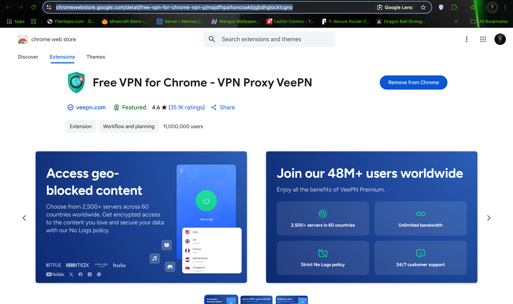
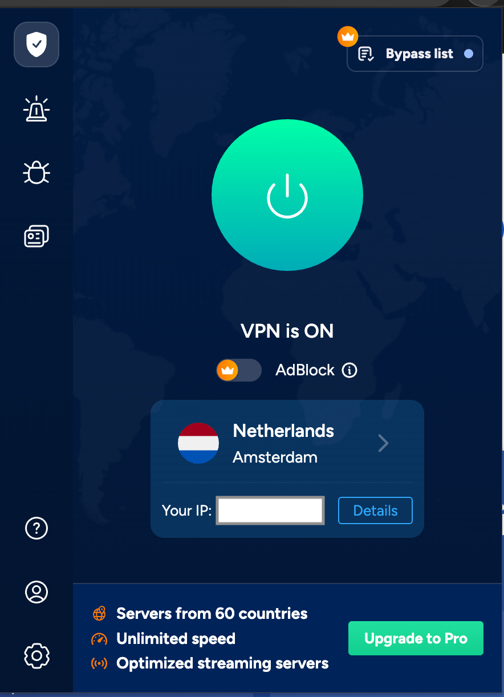
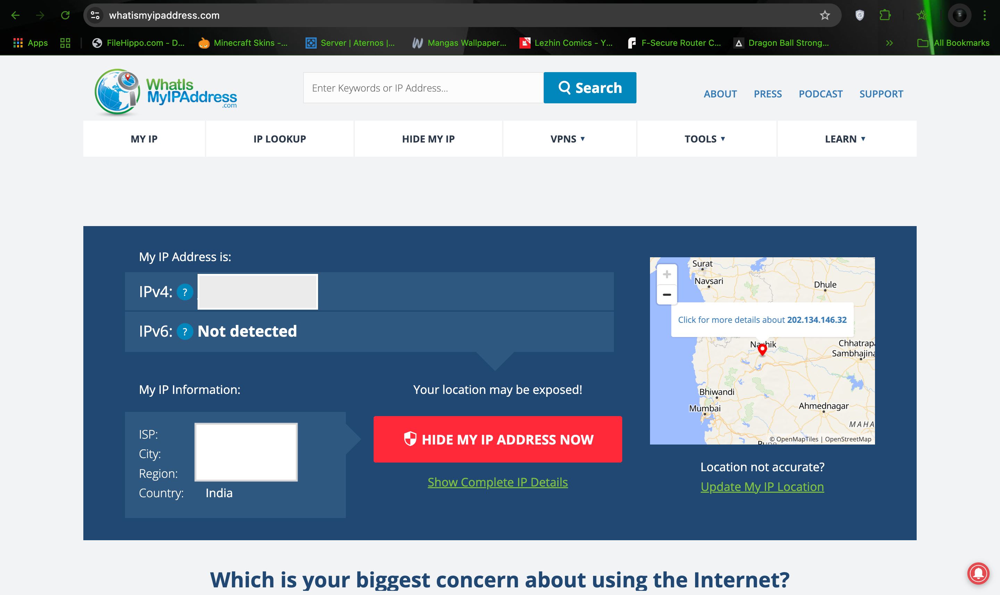
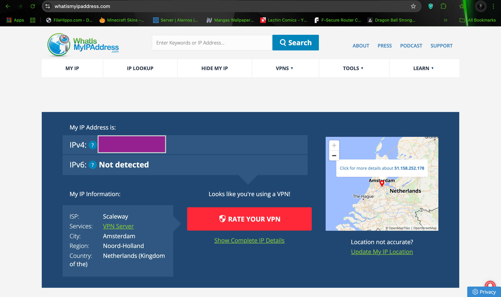
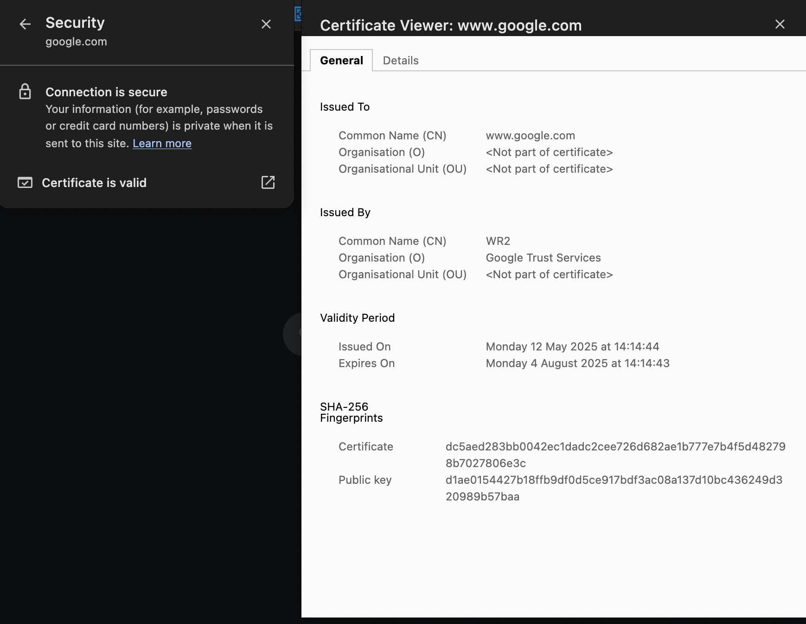

# Understanding the Role of VPNs in Protecting Privacy and Secure Communication

This project demonstrates how Virtual Private Networks (VPNs) help protect user privacy and enable secure communication online. It involves hands-on steps using a Chrome-based VPN extension and highlights VPN functionality, encryption, and performance considerations.

## 📌 Objective

To explore how VPNs change IP addresses, encrypt traffic, affect browsing speed, and contribute to secure and private internet usage.

---

## ✅ Tasks Completed

### 1. **Chosen VPN Service**
- **VPN Used:** [Free VPN for Chrome – VPN Proxy VeePN](https://chrome.google.com/webstore/detail/free-vpn-for-chrome-vpn-pr/oppjbgbfjejepdblkkkblfemjplmepce)
- Downloaded and installed via Chrome Web Store.

📸 **Screenshot:**

---

### 2. **Installation and Connection to VPN Server**
- Installed the VPN extension in Chrome.
- Signed up for a free account.
- **Server Location Selected:** Amsterdam
- Successfully connected.

📸 **Screenshot:**

---

### 3. **IP Address Verification**
- Verified IP address change using [WhatIsMyIPAddress.com](https://whatismyipaddress.com).

📸 **Screenshots:**
- Before VPN:  
  

- After VPN (Amsterdam IP):  
  

---

### 4. **Traffic Encryption Confirmation**
To confirm encrypted traffic:
- Visit any secure website (e.g., `https://example.com`).
- Click the lock icon in Chrome’s address bar.
- Click “Connection is secure” → then “Certificate” to view HTTPS encryption details.

📸 **Screenshot:**

---

### 6. **VPN Disconnected – Speed/IP Comparison**
- Disconnected from the VPN.
- Compared IP and browsing speed on the same website.

📸 **Screenshot:**
.png)
.png)

---

### 7. **VPN Encryption & Privacy Features Research**
- VPNs use protocols like **OpenVPN**, **WireGuard**, and **IKEv2/IPSec**.
- Key privacy features:
  - IP masking
  - No-log policies (provider dependent)
  - DNS leak protection
  - Kill switches

---

### 8. **Summary of VPN Benefits & Limitations**

#### ✅ Benefits:
- Hides real IP address
- Encrypts internet traffic
- Secures public Wi-Fi usage
- Bypasses regional restrictions

#### ⚠️ Limitations:
- Free VPNs may collect logs or display ads
- Can slow down internet speed
- Not a full substitute for antivirus or secure browsing practices
- Trust in the provider is essential

---

## 🛡️ Conclusion

VPNs are powerful tools for enhancing digital privacy and securing online activities. This project provided practical experience in setting up, using, and analyzing the effectiveness of a VPN for everyday use.

---

## 📸 Screenshots

All screenshots are stored in the `screenshots/` folder and embedded above under each respective section.

---

## 📝 License

This project is licensed under the [MIT License](LICENSE). You are free to use, modify, and distribute this project with proper attribution.
